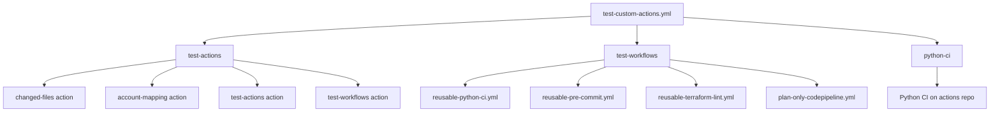

# Reusable Workflows

[](https://github.com/chaunceyyann/cyan-actions/actions/workflows/test-custom-actions.yml)
[](https://github.com/chaunceyyann/cyan-actions/actions/workflows/pr-checks.yml)

This directory contains reusable GitHub Actions workflows that can be shared across multiple repositories.

## 📋 Available Workflows

### [reusable-python-ci.yml](reusable-python-ci.yml)

A comprehensive Python CI workflow with linting, unit tests, and integration tests.

**Usage:**
```yaml
name: Python CI
on:
  pull_request:
    branches: [main]
jobs:
  python-ci:
    uses: chaunceyyann/cyan-actions/.github/workflows/reusable-python-ci.yml@main
    with:
      python-version: '3.11'
      run-integration-tests: true
      test-directory: 'tests'
      requirements-file: 'requirements.txt'
```

**Inputs:**
- `python-version` (string): Python version to use (default: "3.11")
- `run-integration-tests` (boolean): Whether to run integration tests (default: true)
- `python-files-pattern` (string): Regex pattern for Python files (default: ".*\\.py$")
- `test-directory` (string): Directory containing tests (default: "tests")
- `requirements-file` (string): Path to requirements.txt (default: "requirements.txt")
- `install-command` (string): Custom install command (default: "")

**Jobs:**
- **lint**: Runs flake8 on changed Python files
- **unit-test**: Runs unit tests with pytest
- **integration-test**: Runs integration tests (conditional)

**Features:**
- Only runs on changed files for efficiency
- Configurable Python version and test directories
- Flexible dependency installation
- Comprehensive error handling and logging

### [reusable-pre-commit.yml](reusable-pre-commit.yml)

Runs pre-commit checks on changed files in pull requests and pushes.

**Usage:**
```yaml
name: Pre-commit Checks
on:
  pull_request:
  push:
    branches: [main]
jobs:
  pre-commit:
    uses: chaunceyyann/cyan-actions/.github/workflows/reusable-pre-commit.yml@main
    with:
      python-version: '3.11'
      fetch-depth: '0'
```

**Inputs:**
- `python-version` (string): Python version to use (default: "3.x")
- `fetch-depth` (string): Git fetch depth for diff calculation (default: "0")

**Features:**
- Automatically detects changed files
- Runs pre-commit hooks only on modified files
- Supports both PRs and direct pushes
- Configurable Python version and git depth

### [reusable-terraform-lint.yml](reusable-terraform-lint.yml)

Runs Terraform linting and validation on changed Terraform files.

**Usage:**
```yaml
name: Terraform Lint
on:
  pull_request:
    branches: [main]
jobs:
  terraform-lint:
    uses: chaunceyyann/cyan-actions/.github/workflows/reusable-terraform-lint.yml@main
    with:
      terraform-version: '1.5.0'
      terraform-files-pattern: ".*\\.tf$"
```

**Inputs:**
- `terraform-version` (string): Terraform version to use (default: "1.5.0")
- `terraform-files-pattern` (string): Regex pattern for Terraform files (default: ".*\\.tf$")

**Features:**
- Runs terraform fmt, validate, and plan
- Only processes changed Terraform files
- Configurable Terraform version
- Detailed output and error reporting

### [plan-only-codepipeline.yml](plan-only-codepipeline.yml)

Triggers AWS CodePipeline for plan-only operations with environment-aware account routing.

**Usage:**
```yaml
name: Plan-Only CodePipeline
on:
  pull_request:
    branches: [main]
jobs:
  plan-pipeline:
    uses: chaunceyyann/cyan-actions/.github/workflows/plan-only-codepipeline.yml@main
    with:
      environment: "dev"
      pipeline-name: "my-terraform-pipeline"
```

**Inputs:**
- `environment` (string): Target environment (dev, prod, etc.)
- `pipeline-name` (string): Name of the CodePipeline to trigger

**Features:**
- Environment-aware account routing
- Integrates with account-mapping action
- Triggers CodePipeline with plan-only mode
- Comprehensive error handling

### [test-custom-actions.yml](test-custom-actions.yml)

Tests all custom actions and reusable workflows in this repository.

**Usage:**
```yaml
name: Test Actions and Workflows
on:
  pull_request:
    branches: [master, dev]
jobs:
  test-actions:
    uses: ./.github/workflows/test-custom-actions.yml
```

**Jobs:**
- **test-actions**: Tests custom actions for syntax and functionality
- **test-workflows**: Tests reusable workflows for configuration
- **python-ci**: Runs Python CI on the actions repository

**Features:**
- Comprehensive testing of all custom actions
- Validates workflow configurations
- Ensures quality and reliability
- Runs on every PR and push

## 🔧 Workflow Structure

Each reusable workflow follows this pattern:

```yaml
name: Workflow Name (Reusable)

on:
  workflow_call:
    inputs:
      # Define inputs here
    secrets:
      # Define secrets here (optional)

jobs:
  job-name:
    runs-on: ubuntu-latest
    steps:
      # Define steps here
```

## 📊 Workflow Relationships



## 🚀 Using Workflows in Other Repositories

### Basic Usage

```yaml
# .github/workflows/ci.yml
name: CI
on:
  pull_request:
    branches: [main]
jobs:
  python-ci:
    uses: chaunceyyann/cyan-actions/.github/workflows/reusable-python-ci.yml@main
    with:
      python-version: '3.11'
      run-integration-tests: true
```

### Advanced Usage

```yaml
# .github/workflows/ci.yml
name: CI
on:
  pull_request:
    branches: [main]
jobs:
  pre-commit:
    uses: chaunceyyann/cyan-actions/.github/workflows/reusable-pre-commit.yml@main
    with:
      python-version: '3.11'
      fetch-depth: '0'

  python-ci:
    uses: chaunceyyann/cyan-actions/.github/workflows/reusable-python-ci.yml@main
    with:
      python-version: '3.11'
      test-directory: 'src/tests'
      requirements-file: 'src/requirements.txt'
      install-command: 'pip install -e .'

  terraform-lint:
    uses: chaunceyyann/cyan-actions/.github/workflows/reusable-terraform-lint.yml@main
    with:
      terraform-version: '1.5.0'
```

## 🔧 Development

### Creating a New Workflow

1. Create a new `.yml` file in `.github/workflows/`
2. Define `workflow_call` trigger with inputs
3. Implement jobs and steps
4. Add comprehensive testing
5. Update this README

### Workflow Best Practices

- **Use semantic versioning** for workflow releases
- **Provide clear documentation** with examples
- **Include comprehensive inputs** for flexibility
- **Handle errors gracefully** with meaningful messages
- **Test workflows thoroughly** before releasing
- **Use consistent naming** conventions

### Testing Workflows

```bash
# Validate YAML syntax
yamllint .github/workflows/*.yml

# Test workflow locally (if possible)
# Use act or similar tool

# Test in a separate repository
# Create a test repo to validate workflow usage
```

## 📚 Related Documentation

- [Custom Actions](../actions/README.md) - Actions used by these workflows
- [Git Hooks](../../hooks/README.md) - Development workflow automation
