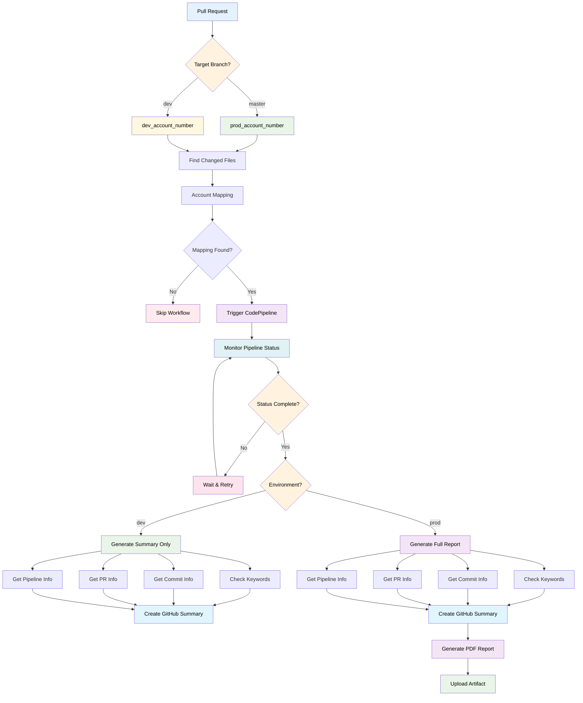
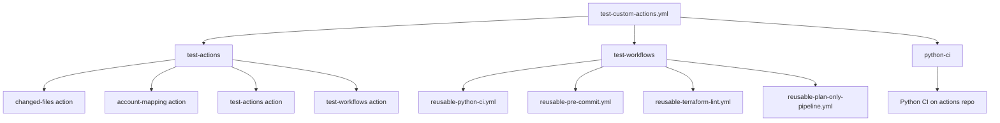

# Reusable Workflows

[](https://github.com/chaunceyyann/cyan-actions/actions/workflows/test-custom-actions.yml)
[](https://github.com/chaunceyyann/cyan-actions/actions/workflows/pr-checks.yml)

This directory contains reusable GitHub Actions workflows that can be shared across multiple repositories.

## 📋 Available Workflows

### [reusable-python-ci.yml](reusable-python-ci.yml)

A comprehensive Python CI workflow with linting, unit tests, and integration tests.

**Usage:**
```yaml
name: Python CI
on:
  pull_request:
    branches: [main]
jobs:
  python-ci:
    uses: chaunceyyann/cyan-actions/.github/workflows/reusable-python-ci.yml@v0.1
    with:
      python-version: '3.11'
      run-integration-tests: true
      test-directory: 'tests'
      requirements-file: 'requirements.txt'
```

**Inputs:**
- `python-version` (string): Python version to use (default: "3.11")
- `run-integration-tests` (boolean): Whether to run integration tests (default: true)
- `python-files-pattern` (string): Regex pattern for Python files (default: ".*\\.py$")
- `test-directory` (string): Directory containing tests (default: "tests")
- `requirements-file` (string): Path to requirements.txt (default: "requirements.txt")
- `install-command` (string): Custom install command (default: "")
- `codebuild-runner` (string): CodeBuild runner label to use (optional)

**Jobs:**
- **lint**: Runs flake8 on changed Python files
- **unit-test**: Runs unit tests with pytest
- **integration-test**: Runs integration tests (conditional)

**Features:**
- Only runs on changed files for efficiency
- Configurable Python version and test directories
- Flexible dependency installation
- Comprehensive error handling and logging

### [reusable-pre-commit.yml](reusable-pre-commit.yml)

Runs pre-commit checks on changed files in pull requests and pushes.

**Usage:**
```yaml
name: Pre-commit Checks
on:
  pull_request:
  push:
    branches: [main]
jobs:
  pre-commit:
    uses: chaunceyyann/cyan-actions/.github/workflows/reusable-pre-commit.yml@v0.1
    with:
      python-version: '3.11'
      fetch-depth: '0'
```

**Inputs:**
- `python-version` (string): Python version to use (default: "3.x")
- `fetch-depth` (string): Git fetch depth for diff calculation (default: "0")
- `codebuild-runner` (string): CodeBuild runner label to use (optional)

**Features:**
- Automatically detects changed files
- Runs pre-commit hooks only on modified files
- Supports both PRs and direct pushes
- Configurable Python version and git depth

### [reusable-terraform-lint.yml](reusable-terraform-lint.yml)

Runs Terraform linting and validation on changed Terraform files.

**Usage:**
```yaml
name: Terraform Lint
on:
  pull_request:
    branches: [main]
jobs:
  terraform-lint:
    uses: chaunceyyann/cyan-actions/.github/workflows/reusable-terraform-lint.yml@v0.1
    with:
      working-directory: '.'
      tflint-version: 'v0.44.1'
      aws-ruleset-version: '0.40.0'
```

**Inputs:**
- `working-directory` (string): Working directory containing Terraform files (default: ".")
- `tflint-version` (string): TFLint version to use (default: "v0.44.1")
- `aws-ruleset-version` (string): AWS ruleset version to use (default: "0.40.0")
- `fetch-depth` (string): Git fetch depth for diff calculation (default: "0")
- `codebuild-runner` (string): CodeBuild runner label to use (optional)

**Features:**
- Runs terraform fmt, validate, and plan
- Only processes changed Terraform files
- Configurable Terraform version
- Detailed output and error reporting

### [reusable-pr-status-commenter.yml](reusable-pr-status-commenter.yml)

Automatically posts success comments on pull requests when all required checks pass.

**Usage:**
```yaml
name: PR Status Comments
on:
  pull_request:
    types: [opened, synchronize, reopened]
jobs:
  comment-status:
    uses: chaunceyyann/cyan-actions/.github/workflows/reusable-pr-status-commenter.yml@v0.1
    with:
      required-checks: "pre-commit,terraform-lint,test-actions,test-workflows,python-ci"
```

**Inputs:**
- `required-checks` (string): Comma-separated list of required checks to monitor (default: "pre-commit,terraform-lint,test-actions,test-workflows,python-ci")
- `codebuild-runner` (string): CodeBuild runner label to use (optional)

**Features:**
- Monitors specified checks and posts success comments only
- Simple workflow name-based check matching
- Concise 2-line comment format
- Uses action's default success template
- Only runs on pull request events
- Supports CodeBuild runners

### [reusable-plan-only-pipeline.yml](reusable-plan-only-pipeline.yml)

A comprehensive reusable workflow for triggering AWS CodePipeline plan-only operations with environment-aware account routing, keyword checking, and PDF report generation.

#### 🎯 Overview

This workflow automates the process of triggering AWS CodePipeline plan-only executions based on pull request changes. It intelligently routes to the correct AWS account based on the target branch, performs security checks, monitors pipeline execution, and generates comprehensive reports.

#### 📊 Workflow Diagram



#### 🚀 Usage

```yaml
name: Plan-Only CodePipeline
on:
  pull_request:
    types: [labeled]
    branches: [dev, master]
jobs:
  plan-only-codepipeline:
    uses: chaunceyyann/cyan-actions/.github/workflows/reusable-plan-only-pipeline.yml@v0.1
    with:
      aws-region: 'us-west-2'
      pipeline-name: 'aft-customization-plan-only'
      timeout-minutes: '30'
      patterns: 'noodle_king,secret_key,password,api_key,token'
      file-patterns: |
        ^src/.*
        ^tests/.*
    secrets:
      aws-access-key-id: ${{ secrets.AWS_ACCESS_KEY_ID }}
      aws-secret-access-key: ${{ secrets.AWS_SECRET_ACCESS_KEY }}
```

#### 📋 Inputs

| Input | Type | Required | Default | Description |
|-------|------|----------|---------|-------------|
| `aws-region` | string | No | `us-west-2` | AWS region for the pipeline |
| `pipeline-name` | string | No | `aft-customization-plan-only` | Name of the CodePipeline to trigger |
| `timeout-minutes` | string | No | `30` | Timeout in minutes for pipeline execution |
| `patterns` | string | No | `noodle_king,secret_key,password,api_key,token` | Comma-separated patterns to check for sensitive keywords |
| `file-patterns` | string | No | `^src/.*` and `^tests/.*` | Patterns to match changed files for account mapping |
| `codebuild-runner` | string | No | `''` | CodeBuild runner label to use |

#### 🔐 Secrets

| Secret | Required | Description |
|--------|----------|-------------|
| `aws-access-key-id` | Yes | AWS access key ID for pipeline access |
| `aws-secret-access-key` | Yes | AWS secret access key for pipeline access |

#### 🔄 Jobs

##### **trigger-codepipeline**
Determines platform, finds changed files, maps accounts, and triggers CodePipeline.

**Steps:**
1. **Checkout**: Deep clone repository for file analysis
2. **Determine Platform**: Sets platform based on target branch (master → prod, dev → dev)
3. **Find Changed Files**: Uses `changed-files` action to detect modified files
4. **Account Mapping**: Maps changed files to AWS account numbers
5. **Check Mapping**: Validates if account mapping was found
6. **Trigger Pipeline**: Calls AWS CodePipeline with account-specific parameters

**Outputs:**
- `execution-id`: CodePipeline execution ID
- `platform`: Determined platform (prod_account_number/dev_account_number)
- `target-account`: Mapped AWS account number
- `skip-workflow`: Whether to skip the entire workflow

##### **generate-summary**
Checks for sensitive keywords, monitors pipeline status, generates summary, and creates PDF report (prod only).

**Steps:**
1. **Keyword Check**: Scans code changes for sensitive patterns
2. **Pipeline Status**: Monitors CodePipeline execution with polling
3. **Commit Info**: Retrieves commit details using git commands
4. **PR Info**: Gets pull request information
5. **Generate Summary**: Creates comprehensive GitHub step summary
6. **PDF Report**: Generates professional PDF report (prod environment only)
7. **Upload Artifact**: Uploads PDF as workflow artifact (prod environment only)

**Environment Behavior:**
- **Dev Environment**: Generates GitHub step summary only
- **Prod Environment**: Generates both GitHub summary and PDF report with artifact upload

#### ✨ Features

- **🔍 Environment-Aware Routing**: Automatically routes to dev/prod accounts based on target branch
- **📁 Smart File Detection**: Only processes relevant changed files for account mapping
- **🔒 Security Scanning**: Checks for sensitive keywords in code changes
- **⏱️ Intelligent Monitoring**: Polls pipeline status with configurable timeout
- **📊 Rich Reporting**: Generates GitHub summary for all environments, PDF reports for prod only
- **🎨 Professional Output**: Formatted tables, status indicators, and timestamps
- **📦 Artifact Management**: Uploads PDF reports as downloadable artifacts (prod environment)
- **🌍 Environment-Aware Reporting**: Different reporting levels based on target environment
- **🔄 Modular Design**: Uses custom actions for maintainability and reusability

#### 📈 Output Examples

**GitHub Step Summary:**
```markdown
## CodePipeline Execution Summary

### Execution Details
| Platform          | prod_account_number |
| Target Account    | 123456789012 |
| AWS Region        | us-west-2 |

### Pull Request
| PR Number         | #42 |
| Title             | Add new feature for user authentication |
| Author            | john-doe |
| Link              | [View Pull Request](https://github.com/chaunceyyann/cyan-actions/pull/42) |

### Pipeline Status
| Execution ID      | xyz789 |
| Status            | ✅ **Succeeded** ✅ |
| Start Time        | Jan 15, 2024 at 5:25 AM EST |

### Pipeline Variables
| Variable Name | Value |
|---------------|-------|
| VENDED_ACCOUNT_ID | 123456789012 |
| ENVIRONMENT | production |
```

**PDF Report:**
- Professional PDF with tables and styling
- Formatted timestamps in US Eastern timezone
- Combined pipeline information sections
- Downloadable as workflow artifact

#### 🔧 Customization

**Custom Account Mapping:**
```yaml
with:
  file-patterns: |
    ^infrastructure/.*
    ^terraform/.*
    ^cloudformation/.*
```

**Custom Security Patterns:**
```yaml
with:
  patterns: 'custom_secret,internal_key,prod_password'
```

**Different Pipeline:**
```yaml
with:
  pipeline-name: 'my-custom-plan-pipeline'
  aws-region: 'us-east-1'
  timeout-minutes: '45'
```

#### 🚨 Error Handling

- **No Account Mapping**: Workflow skips gracefully with informative message
- **Pipeline Timeout**: Configurable timeout with detailed error reporting
- **AWS Errors**: Comprehensive error messages with debugging information
- **Missing Files**: Graceful handling of missing or inaccessible files

#### 📚 Integration

This workflow integrates with several custom actions:
- `changed-files`: Detects modified files
- `account-mapping`: Maps files to AWS accounts
- `run-codepipeline`: Triggers AWS CodePipeline
- `check-keywords`: Scans for sensitive patterns
- `check-codepipeline`: Monitors pipeline status
- `generate-pdf-report`: Creates PDF reports

### [test-custom-actions.yml](test-custom-actions.yml)

Tests all custom actions and reusable workflows in this repository.

**Usage:**
```yaml
name: Test Actions and Workflows
on:
  pull_request:
    branches: [master, dev]
jobs:
  test-actions:
    uses: ./.github/workflows/test-custom-actions.yml
```

**Jobs:**
- **test-actions**: Tests custom actions for syntax and functionality
- **test-workflows**: Tests reusable workflows for configuration
- **python-ci**: Runs Python CI on the actions repository

**Features:**
- Comprehensive testing of all custom actions
- Validates workflow configurations
- Ensures quality and reliability
- Runs on every PR and push

## 🔧 Workflow Structure

Each reusable workflow follows this pattern:

```yaml
name: Workflow Name (Reusable)

on:
  workflow_call:
    inputs:
      # Define inputs here
    secrets:
      # Define secrets here (optional)

jobs:
  job-name:
    runs-on: ubuntu-latest
    steps:
      # Define steps here
```

## 📊 Workflow Relationships



## 🚀 Using Workflows in Other Repositories

### Basic Usage

```yaml
# .github/workflows/ci.yml
name: CI
on:
  pull_request:
    branches: [main]
jobs:
  python-ci:
    uses: chaunceyyann/cyan-actions/.github/workflows/reusable-python-ci.yml@v0.1
    with:
      python-version: '3.11'
      run-integration-tests: true
```

### Advanced Usage

```yaml
# .github/workflows/ci.yml
name: CI
on:
  pull_request:
    branches: [main]
jobs:
  pre-commit:
    uses: chaunceyyann/cyan-actions/.github/workflows/reusable-pre-commit.yml@v0.1
    with:
      python-version: '3.11'
      fetch-depth: '0'

  python-ci:
    uses: chaunceyyann/cyan-actions/.github/workflows/reusable-python-ci.yml@v0.1
    with:
      python-version: '3.11'
      test-directory: 'src/tests'
      requirements-file: 'src/requirements.txt'
      install-command: 'pip install -e .'

  terraform-lint:
    uses: chaunceyyann/cyan-actions/.github/workflows/reusable-terraform-lint.yml@v0.1
    with:
      terraform-version: '1.5.0'

  plan-only-pipeline:
    uses: chaunceyyann/cyan-actions/.github/workflows/reusable-plan-only-pipeline.yml@v0.1
    with:
      aws-region: 'us-east-1'
      pipeline-name: 'my-custom-pipeline'
      patterns: 'custom_pattern,another_pattern'
    secrets:
      aws-access-key-id: ${{ secrets.AWS_ACCESS_KEY_ID }}
      aws-secret-access-key: ${{ secrets.AWS_SECRET_ACCESS_KEY }}
```

## 🔧 Development

### Creating a New Workflow

1. Create a new `.yml` file in `.github/workflows/`
2. Define `workflow_call` trigger with inputs
3. Implement jobs and steps
4. Add comprehensive testing
5. Update this README

### Workflow Best Practices

- **Use semantic versioning** for workflow releases
- **Provide clear documentation** with examples
- **Include comprehensive inputs** for flexibility
- **Handle errors gracefully** with meaningful messages
- **Test workflows thoroughly** before releasing
- **Use consistent naming** conventions

### Testing Workflows

```bash
# Validate YAML syntax
yamllint .github/workflows/*.yml

# Test workflow locally (if possible)
# Use act or similar tool

# Test in a separate repository
# Create a test repo to validate workflow usage
```

## 📚 Related Documentation

- [Custom Actions](../actions/README.md) - Actions used by these workflows
- [Git Hooks](../../hooks/README.md) - Development workflow automation
