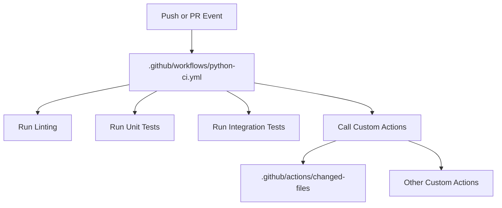

# Shared GitHub Actions Workflows & Custom Actions

This repository serves as a central hub for all my shared [GitHub Actions](https://github.com/features/actions) workflows and custom actions. The goal is to provide reusable, well-documented automation building blocks for use across multiple projects.

## Purpose

- **Centralize**: Host all shared workflows and custom actions in one place.
- **Reuse**: Make it easy to include and update workflows across repositories.
- **Customize**: Provide tailored automation solutions for common CI/CD needs.

## Usage

You can reference workflows or actions from this repository in your own projects. For example:

### Reusing a Workflow

To reuse a workflow from this repository, use the `uses` keyword in your workflow YAML:

```yaml
# .github/workflows/your-workflow.yml
name: Use Shared Workflow
on:
  push:
    branches: [ master ]
jobs:
  call-shared-workflow:
    uses: chaunceyyann/cyan-actions/.github/workflows/shared-workflow.yml@master
    with:
      example-input: "Hello, World!"        # replace with real inputs
    secrets:
      example-secret: ${{ secrets.MY_SECRET }}  # replace with real secrets
```

### Using a Custom Action

To use a custom action from this repository, reference its path and version in your workflow steps:

```yaml
# .github/workflows/your-workflow.yml
name: Use Custom Action
on:
  push:
    branches: [ master ]
jobs:
  use-custom-action:
    runs-on: ubuntu-latest
    steps:
      - uses: actions/checkout@v4
      - uses: chaunceyyann/cyan-actions/path/to/custom-action@master
        with:
          action-input: "Some value"          # replace with real inputs
```

> **Note**: Update `shared-workflow.yml` and `path/to/custom-action` to the actual file/action paths, and adjust inputs/secrets as needed.

## Testing Custom Actions

This repository includes a workflow to automatically test changed workflows and actions. It triggers on:

- Pull requests opened against `dev` (feature → dev)
- Pull requests opened against `master` (dev → master)
- Pushes to `dev` (post-merge of feature)
- Pushes to `master` (post-merge of release)

The tests run whenever files under `.github/actions/**` or `.github/workflows/**` are modified.

See [.github/workflows/test-custom-actions.yml](.github/workflows/test-custom-actions.yml) for details.

## 📊 Example: Workflow Relationship Diagram

Below is a Mermaid diagram showing how reusable workflows and custom actions interact in this repository:



> **Note:** GitHub supports Mermaid diagrams in Markdown files. If you see a diagram above, your platform supports Mermaid!

## Status

[](https://github.com/chaunceyyann/cyan-actions/actions)


---

Feel free to contribute or suggest improvements!

# GitHub Actions Repository

This repository contains shared GitHub Actions workflows and custom actions for CI/CD automation.

## Features

- **Custom Actions**: Reusable composite actions for common tasks
- **Shared Workflows**: Standardized CI/CD workflows
- **Account Mapping**: Environment-aware AWS account routing
- **Git Hooks**: Automated commit message formatting with JIRA integration

## Quick Start

### 1. Install pre-commit

```bash
# Install pre-commit
pip install pre-commit

# Or with Homebrew (macOS)
brew install pre-commit
```

### 2. Install Git hooks

```bash
# Install the pre-commit hooks
pre-commit install

# Install the prepare-commit-msg hook specifically
pre-commit install --hook-type prepare-commit-msg
```

### 3. Verify installation

```bash
# Check installed hooks
pre-commit run --all-files

# Test the prepare-commit-msg hook
git commit --allow-empty -m "test commit"
```

## Using the JIRA Commit Hook

The `commit-msg` hook automatically adds JIRA ticket numbers to commit messages based on your branch name.

### Git Hook Execution Order

```bash
git commit
├── 1. pre-commit hooks run
├── 2. prepare-commit-msg hook runs
├── 3. Git opens editor with commit message
├── 4. User edits message and saves/closes editor
├── 5. commit-msg hook runs ← This is where we can reliably modify
└── 6. Git creates the commit
```

**Why we use `commit-msg`**: This hook runs after the editor closes but before the commit is created, ensuring the JIRA ticket is reliably added regardless of how you commit.

### Branch Naming Examples

| Branch Name | JIRA Ticket | Commit Message Result |
|-------------|-------------|----------------------|
| `feature/ABC-123-add-login` | ABC-123 | `[ABC-123] your message` |
| `bugfix/PROJECT-456-fix-bug` | PROJECT-456 | `[PROJECT-456] your message` |
| `hotfix/ABC789-critical-fix` | ABC-789 | `[ABC-789] your message` |
| `feature/ABC123-description` | ABC-123 | `[ABC-123] your message` |

### Supported Patterns

- **Standard**: `JIRA-123`, `ABC-456`
- **No dash**: `ABC123`, `PROJECT456` (auto-converts to `ABC-123`)
- **Custom**: `AB-123` (at least 2 letters)

### Skipped Commits

The hook automatically skips:
- Merge commits
- Revert commits
- Commits starting with: `Merge`, `Revert`, `WIP`, `Draft`

### Manual Testing

```bash
# Create a test branch with JIRA ticket
git checkout -b feature/ABC-123-test-hook

# Make a commit
git commit --allow-empty -m "test commit message"

# Should see: ✅ Added JIRA ticket [ABC-123] to commit message from branch: feature/ABC-123-test-hook
```

## Custom Actions

### Account Mapping Action

Maps changed files to AWS accounts based on environment and file patterns.

```yaml
- name: Determine account number
  uses: ./.github/actions/account-mapping
  with:
    changed-files: ${{ steps.changes.outputs.files }}
    environment: ${{ steps.env.outputs.aft_account }}
```

### Changed Files Action

Detects changed files based on regex patterns.

```yaml
- name: Find changed files
  uses: ./.github/actions/changed-files
  with:
    pattern: |
      ^src/.*
      ^tests/.*
```

## Workflows

### Plan-Only CodePipeline

Triggers AWS CodePipeline for plan-only operations with environment-aware account routing.

```yaml
- name: Plan-Only CodePipeline Trigger
  uses: ./.github/workflows/plan-only-codepipeline.yml
```

## Development

### Adding New Hooks

1. Create your hook script in `hooks/`
2. Add it to `.pre-commit-config.yaml`
3. Install with `pre-commit install`

### Testing Hooks

```bash
# Run all hooks on staged files
pre-commit run

# Run specific hook
pre-commit run prepare-commit-msg

# Run on all files
pre-commit run --all-files
```

### Updating Hooks

```bash
# Update hook versions
pre-commit autoupdate

# Reinstall hooks
pre-commit install
```

## Configuration

### JIRA Hook Configuration

Edit `hooks/prepare-commit-msg` to customize:

- **JIRA Patterns**: Modify `JIRA_PATTERNS` array
- **Skip Prefixes**: Add to `SKIP_PREFIXES` array
- **Format**: Change `JIRA_PREFIX_FORMAT`

### Pre-commit Configuration

Edit `.pre-commit-config.yaml` to:

- Add/remove hooks
- Configure hook options
- Update hook versions

## Troubleshooting

### Hook Not Running

```bash
# Check if hooks are installed
ls -la .git/hooks/

# Reinstall hooks
pre-commit install --overwrite
```

### JIRA Ticket Not Detected

```bash
# Check branch name
git branch --show-current

# Test pattern manually
echo "feature/ABC-123-test" | grep -oE '[A-Z]+-[0-9]+'
```

### Pre-commit Errors

```bash
# Skip hooks for one commit
git commit --no-verify -m "emergency fix"

# Run hooks manually
pre-commit run --all-files
```

## Contributing

1. Create a feature branch with JIRA ticket: `feature/ABC-123-description`
2. Make your changes to dev
3. Commit with descriptive message (JIRA ticket will be auto-added)
4. Push and create a pull request

## License

MIT License - see LICENSE file for details.

# Cyan Actions

A collection of Git hooks and GitHub Actions for improved development workflow.

## Features

- **Commit Message Hook**: Automatically adds JIRA ticket numbers from branch names to commit messages
- **Pre-commit Checks**: Enforces code quality standards with configurable hooks
- **Reusable Workflows**: Share pre-commit checks across multiple repositories

## Git Hooks

### Commit Message Hook

The `hooks/commit-msg` script automatically prepends JIRA ticket numbers from branch names to commit messages.

**Supported JIRA patterns:**
- `JIRA-123` (standard format)
- `ABC123` (no dash format, automatically converted to `ABC-123`)
- `AB-123` (minimum 2 letters)

**Installation:**
```bash
# Copy the hook to your repository
cp hooks/commit-msg .git/hooks/
chmod +x .git/hooks/commit-msg
```

## Pre-commit Configuration

This repository includes a comprehensive pre-commit configuration with:

- **Trailing whitespace removal**
- **End-of-file newline enforcement**
- **YAML syntax validation**
- **Large file detection**
- **Shell script linting with shellcheck**

**Installation:**
```bash
# Run the installation script
chmod +x install-pre-commit.sh
./install-pre-commit.sh
```

## Reusable Workflows

### Pre-commit Checks Workflow

The `.github/workflows/reusable-pre-commit.yml` provides a reusable workflow that can be used in any repository to enforce pre-commit checks on changed files.

**Usage in other repositories:**

Create a `.github/workflows/pre-commit.yml` file in your repository:

```yaml
name: Pre-Commit Checks

on:
  pull_request:
  push:
    branches: [main]

jobs:
  pre-commit:
    uses: your-username/cyan-actions/.github/workflows/reusable-pre-commit.yml@main
    with:
      python-version: '3.x'
      fetch-depth: '0'
```

**Available inputs:**
- `python-version`: Python version to use (default: '3.x')
- `fetch-depth`: Git fetch depth for diff calculation (default: '0')


**Features:**
- Automatically detects changed files in PRs and pushes
- Only runs checks on modified files for efficiency
- Supports both pull requests and direct pushes to main branch
- Configurable Python version and git fetch depth

## Development

### Testing

Run the test suite:
```bash
# Unit tests
python -m pytest tests/unit/

# Integration tests
python -m pytest tests/integration/
```

### Contributing

1. Fork the repository
2. Create a feature branch with JIRA ticket prefix (e.g., `JIRA-123-feature-name`)
3. Make your changes
4. Ensure pre-commit checks pass
5. Submit a pull request

## License

This project is licensed under the MIT License - see the [LICENSE](LICENSE) file for details.
