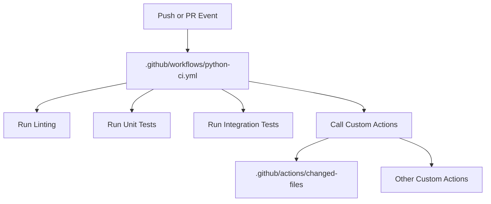

# Shared GitHub Actions Workflows & Custom Actions

This repository serves as a central hub for all my shared [GitHub Actions](https://github.com/features/actions) workflows and custom actions. The goal is to provide reusable, well-documented automation building blocks for use across multiple projects.

## Purpose

- **Centralize**: Host all shared workflows and custom actions in one place.
- **Reuse**: Make it easy to include and update workflows across repositories.
- **Customize**: Provide tailored automation solutions for common CI/CD needs.

## Usage

You can reference workflows or actions from this repository in your own projects. For example:

### Reusing a Workflow

To reuse a workflow from this repository, use the `uses` keyword in your workflow YAML:

```yaml
# .github/workflows/your-workflow.yml
name: Use Shared Workflow
on:
  push:
    branches: [ master ]
jobs:
  call-shared-workflow:
    uses: chaunceyyann/cyan-actions/.github/workflows/shared-workflow.yml@master
    with:
      example-input: "Hello, World!"        # replace with real inputs
    secrets:
      example-secret: ${{ secrets.MY_SECRET }}  # replace with real secrets
```

### Using a Custom Action

To use a custom action from this repository, reference its path and version in your workflow steps:

```yaml
# .github/workflows/your-workflow.yml
name: Use Custom Action
on:
  push:
    branches: [ master ]
jobs:
  use-custom-action:
    runs-on: ubuntu-latest
    steps:
      - uses: actions/checkout@v4
      - uses: chaunceyyann/cyan-actions/path/to/custom-action@master
        with:
          action-input: "Some value"          # replace with real inputs
```

> **Note**: Update `shared-workflow.yml` and `path/to/custom-action` to the actual file/action paths, and adjust inputs/secrets as needed.

## Testing Custom Actions

This repository includes a workflow to automatically test changed workflows and actions. It triggers on:

- Pull requests opened against `dev` (feature → dev)
- Pull requests opened against `master` (dev → master)
- Pushes to `dev` (post-merge of feature)
- Pushes to `master` (post-merge of release)

The tests run whenever files under `.github/actions/**` or `.github/workflows/**` are modified.

See [.github/workflows/test-custom-actions.yml](.github/workflows/test-custom-actions.yml) for details.

## 📊 Example: Workflow Relationship Diagram

Below is a Mermaid diagram showing how reusable workflows and custom actions interact in this repository:



> **Note:** GitHub supports Mermaid diagrams in Markdown files. If you see a diagram above, your platform supports Mermaid!

## Status

[](https://github.com/chaunceyyann/cyan-actions/actions)


---

Feel free to contribute or suggest improvements!